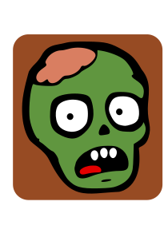

<div align="center">
  
  
  # Zom Nom Defense: Click. Aim. Survive.
</div>

A lighthearted zombie tower defense game with a click-to-kill twist, built with Godot 4.

> 🧟‍♂️ Defend helpless survivors from waves of zombies using nothing but your mouse and some scrap-built defenses. Click zombies for scrap, build automated turrets, and make permanent tech tree choices that shape your playstyle.

---

## 🎮 What Is This?

**Zom Nom Defense** is a lo-fi, chaotic tower defense/clicker hybrid where:
- You **click zombies** to deal manual damage and earn "scrap"
- You spend scrap to **place obstacles and turrets** to automate defense
- You **defend absurd scenarios** (person on a car, survivor in a hammock, inflatable pool party)
- You **unlock tech via achievements** and level up through an XP system
- You make **permanent strategic choices** in a branching tech tree (choose Rapid Fire OR Heavy Damage - forever!)

**Genre**: Tower Defense / Clicker Hybrid  
**Platform**: PC (Steam planned)  
**Tone**: Silly but strategic - light-hearted post-apocalypse chaos

---

## ⚠️ Warning

This is a **work-in-progress passion project**. Core systems are functional, but many features and content are still in development. See the [Development Status](#-development-status) section for details.


---

## 📺 Watch Development Live!

This game is being developed **live on stream**!

**🔴 Twitch**: [twitch.tv/saebyn](https://twitch.tv/saebyn)  
**📅 Schedule**: Sunday mornings  
**🎥 VODs**: [@saebynVODs on YouTube](https://www.youtube.com/@saebynVODs)

Come hang out, watch the chaos unfold, and see how the sausage gets made! You might even witness the birth of a new absurd level scenario or a hilariously broken bug. 🧟‍♂️✨

---

## 📚 Documentation

- **[Architecture Diagrams](docs/ARCHITECTURE.md)** - Comprehensive system architecture with mermaid diagrams
- **[Game Design Document](docs/zom_nom_defense_gdd.md)** - Complete vision for the game
- **[Tech Tree Design](docs/tech_tree_exclusive_branches.md)** - Mutually exclusive branch system
- **[Tech Tree Manager Implementation](docs/TECH_TREE_MANAGER_IMPLEMENTATION.md)** - Complete tech tree system docs
- **[Tech Tree UI Implementation](docs/TECH_TREE_UI_IMPLEMENTATION.md)** - UI implementation details
- **[Achievement UI Implementation](docs/ACHIEVEMENT_UI_IMPLEMENTATION.md)** - Achievement system UI
- **[Obstacle Tech Tree Integration](docs/obstacle_tech_tree_integration.md)** - How obstacles unlock via tech
- **[Color Palette](docs/COLOR_PALETTE.md)** - UI color scheme and theme
- **[Logging System](docs/LOGGING.md)** - How the MyLogger autoload works

---

## 🔧 Developer Tools

- **[Sound Board](Stages/UI/sound_board/)** - Standalone scene for testing and previewing all sound effects defined in AudioManager
  - Run with: `godot --path . "res://Stages/UI/sound_board/sound_board.tscn"`
  - Dynamically displays all available sound effects with playback controls

---

## ✨ Current Features

**What's Working Now**:
- ✅ Click-to-damage enemies with satisfying feedback
- ✅ Scrap currency system (earn from kills, spend on obstacles)
- ✅ XP and leveling system (CurrencyManager)
- ✅ Basic Enemy AI with pathfinding navigation
- ✅ Wave-based enemy spawning
- ✅ Obstacle placement (walls and turrets)
- ✅ Automated turret targeting and shooting
- ✅ Component-based architecture (Health, Attack, Buff systems)
- ✅ UI framework (hotbar, currency display, stats tracking)
- ✅ **Centralized save system with multi-slot support** (SaveManager)
- ✅ **Player progression persistence** (currency, stats, levels, tech tree)
- ✅ **Achievement system** with toast notifications and full achievement list UI
- ✅ **Tech tree system** with mutually exclusive branches and unlock conditions
- ✅ **Tech tree UI** with visual node states and unlock interface
- ✅ **Obstacle unlocking via tech tree** (dynamic availability based on research)
- ✅ **Save slot selection UI** (create, load, delete, manage multiple saves)
- ✅ **Color palette** and theme standardization across UI


---

## 🎯 Controls

Controls are fully rebindable in-game via the Settings menu.

### Camera
- **WARS**: Move camera (up/left/right/down)
- **Q/E**: Rotate camera (90° increments)
- **Mouse Wheel**: Zoom in/out

### Gameplay
- **Left Click**: Attack enemies manually and collect scrapable objects
- **Hotbar (1-9)**: Select obstacle to place
- **Left Click (with obstacle selected)**: Place obstacle
- **Right Click**: Cancel placement

---

## 🚀 Getting Started

### Prerequisites

- [Godot Engine 4.5](https://godotengine.org/download) or later

### Running the Game

1. Clone this repository with submodules:
   ```bash
   git clone --recurse-submodules <repository-url>
   ```
   Or if already cloned:
   ```bash
   git submodule update --init --recursive
   ```
2. Open the project in Godot by importing the `project.godot` file
3. Press F5 or click the "Play" button to run the game

### Running Tests

This project uses [GUT (Godot Unit Testing)](https://github.com/bitwes/Gut) for automated testing.

**Command Line**:
```bash
./run_tests.sh
```

**From Godot Editor**:
1. Open the project in Godot
2. Select the "Gut" tab in the bottom panel
3. Click "Run All"

See [tests/README.md](tests/README.md) for detailed testing documentation.

---

## 🏗️ Project Structure

### Overview

This project uses a feature-based folder structure that prioritizes intuitive organization and co-location of related files. The structure is designed to scale from prototype to full game with 15+ enemy types, 20+ obstacle types, multiple levels, and complex progression systems.

### Top-Level Folders

```
Assets/         # Pure art and audio assets
Common/         # Reusable components and shared UI elements
Config/         # Data-driven configuration files (.tres resources)
Entities/       # Game objects (enemies, obstacles, player systems)
Localization/   # Translation files
Stages/         # Scenes and levels (main game, menus, levels)
Utilities/      # Systems, autoloads, and helper scripts
```

### Key Design Principles

#### 1. **Co-location of Coupled Files**
Related files stay together in their own folders:
```
Common/Effects/shake_effect/
├── shake_effect.tscn
└── shake_effect.gd
```

#### 2. **Template + Config Pattern**
Game entities use a composition approach:
- **Templates** (`Entities/*/Templates/`) - Reusable scene structure and behavior
- **Configs** (`Config/*/`) - Data-driven parameters and stats
- **Concrete** (`Entities/*/Concrete/`) - Specific instances combining templates with configs

#### 3. **Clear Separation by Purpose**
- `Assets/` - Art, audio, models (no code)
- `Config/` - Pure data files for balancing and content
- `Common/` - Truly reusable components across entities
- `Utilities/` - Global systems and autoloads
- `Entities/` - Game-specific objects with their logic
- `Stages/` - Complete scenes and levels

#### 4. **Centralized Game State Management**
Game state and coordination is handled through autoloaded singletons:
- **MyLogger** - Centralized logging with scope-based filtering
- **CurrencyManager** - Player currency tracking and transactions
- **GameManager** - Game state transitions and high-level coordination
- **SaveManager** - Centralized save system with multi-slot support (see [Save System](#-save-system) below)

#### 5. **Save System Architecture**

The game uses a centralized save system (SaveManager) that orchestrates all game persistence:

**Save Location**:
```
user://
├── saves/
│   ├── save_slot_1.save      # Per-slot data (atomic saves)
│   ├── save_slot_1.save.bak  # Automatic backup
│   ├── save_slot_2.save
│   └── save_slot_N.save
└── settings.cfg              # Global settings
```

**SaveableSystem Interface**:
All managers implement a common interface for save coordination:
- `get_save_key() -> String` - Unique identifier
- `get_save_data() -> Dictionary` - Return saveable state
- `load_data(data: Dictionary)` - Restore from saved state  
- `reset_data()` - Reset to defaults for new game

**Per-Slot Data** (resets on new game):
- CurrencyManager: Player level, XP, scrap
- StatsManager: Enemy defeats, obstacles placed
- AchievementManager: In-game achievement progress
- LevelManager: Completed levels, best times/scores
- TechTreeManager: Unlocked tech, locked exclusive branches

**Global Data** (persists across all slots):
- SettingsManager: Video, audio, input settings

**Features**:
- ✅ Atomic writes (temp file + rename prevents corruption)
- ✅ Automatic backups (.save.bak files)
- ✅ Auto-save every 5 minutes + on level completion
- ✅ Multiple save slots (up to 10, expandable)
- ✅ Save slot metadata (timestamp, playtime, player level)
- ✅ Corruption recovery (restores from backup if primary corrupted)

### Example Structure

```
Config/Enemies/
├── grunt_config.tres      # Health: 100, Speed: 2.0, Damage: 15
└── scout_config.tres      # Health: 50, Speed: 4.0, Damage: 10

Entities/Enemies/
├── Templates/
│   └── base_enemy/
│       ├── base_enemy.tscn    # Common enemy structure
│       └── base_enemy.gd      # Common enemy behavior
└── Concrete/
    ├── grunt/
    │   └── grunt.tscn         # base_enemy + grunt_config
    └── scout/
        └── scout.tscn         # base_enemy + scout_config
```

### Benefits

- **Intuitive navigation** - Related files are always together
- **Scalable** - Easy to add new enemy types, levels, and features
- **Data-driven** - Non-programmers can create content via config files
- **Team-friendly** - Clear separation of artist, designer, and programmer work areas
- **Maintainable** - No hunting across multiple folders for related files

This structure supports the game's progression systems (achievements, tech trees, multiple save slots), content variety (levels, enemies, obstacles), and planned features while keeping the codebase organized and approachable.

---

## 🎨 Design Philosophy

**Data-Driven Design**: Game content (enemies, obstacles, tech tree) uses `.tres` resource files, allowing non-programmers to create and balance content without touching code.

**Component-Based Architecture**: Reusable components (Health, Attack, Buff) can be mixed and matched to create diverse game entities.

**Meaningful Choices**: The tech tree features **mutually exclusive branches** - choosing Rapid Fire locks out Heavy Damage permanently (per save slot), creating distinct playstyles and encouraging replayability.

**Multiple Save Slots**: Like Factorio, players can maintain 3+ parallel playthroughs to explore different tech tree paths.

**Achievement Split**: 
- **In-game achievements** reset per save slot (used to unlock tech)
- **Steam achievements** unlock globally and permanently

---

## 🛠️ Development Status

This is a **part-time passion project** worked on inconsistently. No timeline expectations - just methodical progress through well-defined phases.

**Current Phase**: Phase 2 - Content Expansion (tower upgrades, support towers, enemy variety)

**Phase 1 Complete** ✅: Foundation systems (achievements, tech tree, save system) are fully implemented.

See the Github Issues for detailed task tracking.

**Technical Foundation**: Solid component architecture, resource-based configuration, autoload singletons for game state management, comprehensive save system with multi-slot support.

**Content Status**: Core systems functional, progression mechanics fully implemented, content creation ongoing.

---

## 🤝 Contributing & Feedback

This is a personal learning project worked on publicly. While it's not actively seeking contributors, feedback and suggestions are welcome through issues!

**Useful Contributions**:
- Bug reports with reproduction steps
- Balance feedback (when more content is playable)
- Design suggestions for tech tree, achievements, or levels
- Playtesting feedback

---

## 📜 License

This project is licensed under the GNU Affero General Public License v3.0 - see the [LICENSE](LICENSE) file for details.

---

## 🎮 Why "Zom Nom Defense"?

Because zombies go "nom nom nom" and puns are mandatory in lighthearted apocalypse games. 🧟‍♂️🍔

**Tagline**: Click. Aim. Survive.

---

**Built with** [Godot 4.5](https://godotengine.org/) | **Repo**: [github.com/saebyn/zom-nom-defense](https://github.com/saebyn/zom-nom-defense)
