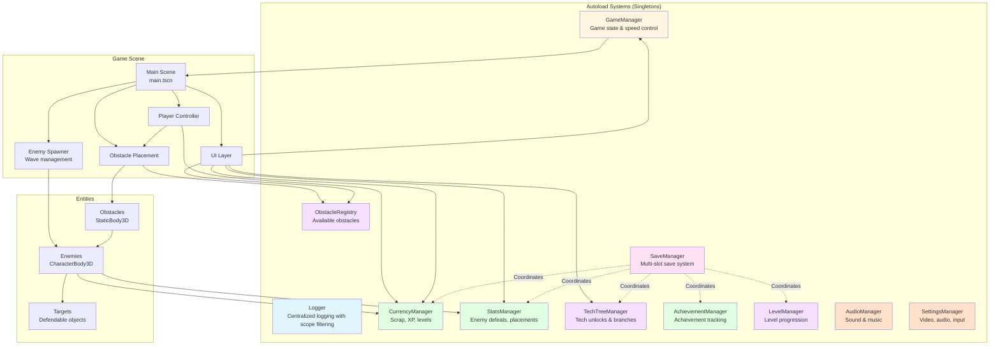
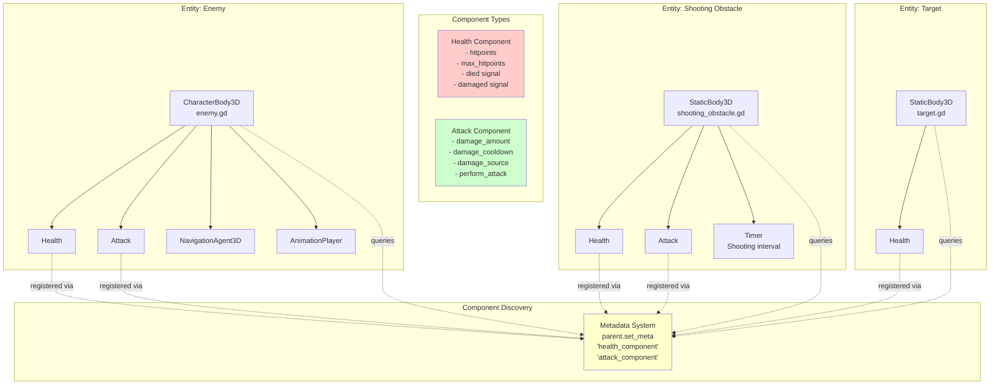
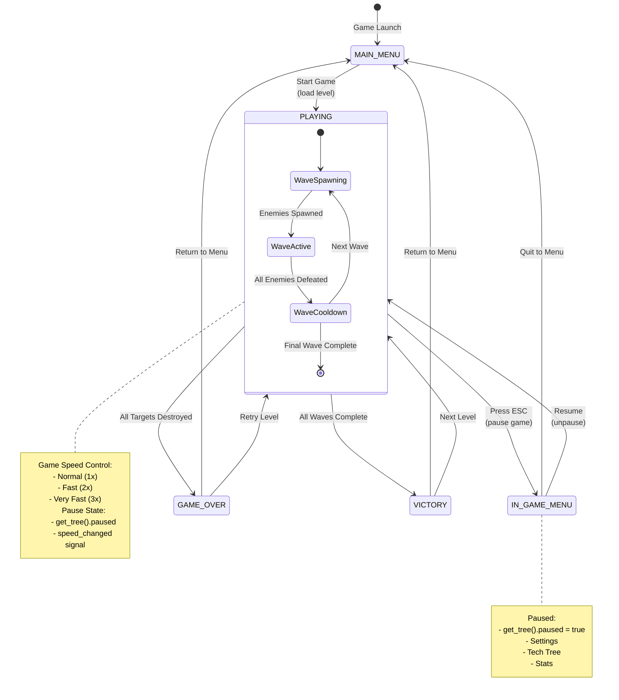
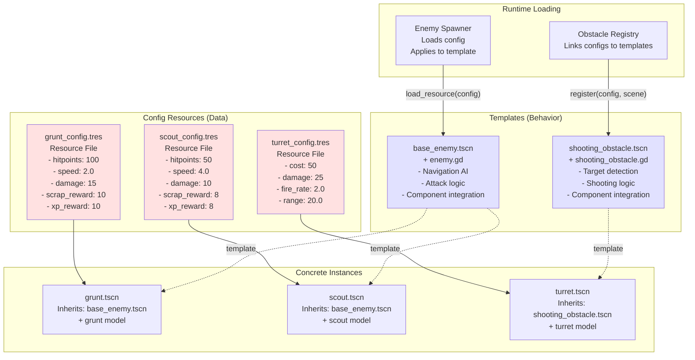
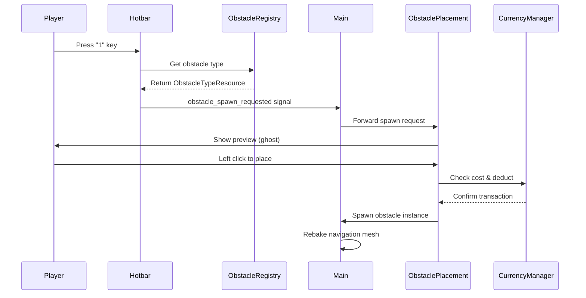
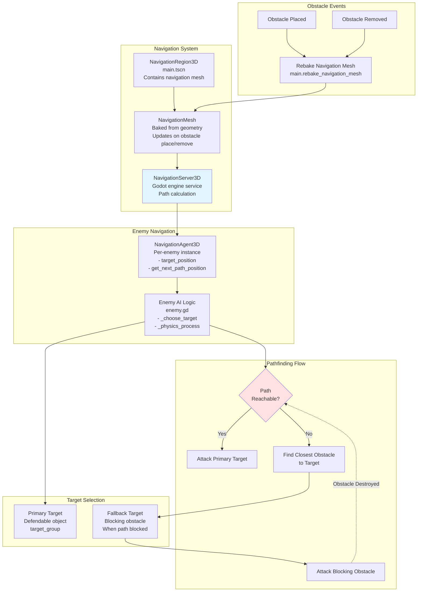

# Zom Nom Defense - Architecture Documentation

This document provides comprehensive architecture diagrams for the Zom Nom Defense project using Mermaid diagrams.

## Table of Contents
- [System Architecture](#system-architecture)
- [Component-Based Entity Architecture](#component-based-entity-architecture)
- [Save System Architecture](#save-system-architecture)
- [Game State & Flow](#game-state--flow)
- [Entity Template + Config Pattern](#entity-template--config-pattern)
- [UI Architecture](#ui-architecture)
- [Navigation & Pathfinding](#navigation--pathfinding)

---

## System Architecture

The game uses several autoloaded singleton systems for global state management and coordination.



**Color Legend:**
- 🔵 **Blue** - Debugging/Infrastructure systems (Logger)
- 🩷 **Pink** - Persistence/Save systems (SaveManager)
- 🟢 **Green** - Economy/Progression systems (CurrencyManager, StatsManager, AchievementManager)
- 🟡 **Yellow** - Game State Management (GameManager)
- 🟣 **Purple** - Content Management systems (ObstacleRegistry, TechTreeManager, LevelManager)
- 🟠 **Orange** - Audio/Settings systems (AudioManager, SettingsManager)

---

## Component-Based Entity Architecture

Entities use a composition pattern with reusable components attached as child nodes.



---

## Save System Architecture

The centralized save system uses a SaveableSystem interface pattern for coordinating persistence across all game systems.

```mermaid
graph TB
    subgraph "SaveManager (Orchestrator)"
        SM[SaveManager<br/>Autoload Singleton]
        SaveSlots[Multi-Slot System<br/>10 slots max]
        AutoSave[Auto-Save Timer<br/>Every 5 minutes]
        AtomicWrite[Atomic Writes<br/>temp + rename]
        Backup[Automatic Backups<br/>.save.bak files]
    end
    
    subgraph "SaveableSystem Interface"
        Interface["Interface Methods:<br/>- get_save_key→String<br/>- get_save_data→Dictionary<br/>- load_data Dictionary<br/>- reset_data"]
    end
    
    subgraph "Registered Systems (Per-Slot Data)"
        Currency[CurrencyManager<br/>scrap, XP, level]
        Stats[StatsManager<br/>defeats, placements]
        Tech[TechTreeManager<br/>unlocks, locked branches]
        Achievements[AchievementManager<br/>in-game progress]
        Levels[LevelManager<br/>completed levels, scores]
    end
    
    subgraph "Global Data (Cross-Slot)"
        Settings[SettingsManager<br/>video, audio, input<br/>Separate persistence]
    end
    
    subgraph "Save File Structure"
        SlotFile["user://saves/save_slot_N.save<br/>{<br/>  version: 1,<br/>  metadata: {timestamp, playtime, level},<br/>  currency_manager: {...},<br/>  stats_manager: {...},<br/>  tech_tree_manager: {...},<br/>  achievement_manager: {...},<br/>  level_manager: {...}<br/>}"]
        SlotBackup[save_slot_N.save.bak]
    end
    
    SM --> SaveSlots
    SM --> AutoSave
    SM --> AtomicWrite
    SM --> Backup
    
    Interface -.implemented by.-> Currency
    Interface -.implemented by.-> Stats
    Interface -.implemented by.-> Tech
    Interface -.implemented by.-> Achievements
    Interface -.implemented by.-> Levels
    
    SM -.register_system.-> Currency
    SM -.register_system.-> Stats
    SM -.register_system.-> Tech
    SM -.register_system.-> Achievements
    SM -.register_system.-> Levels
    
    SM -- save_current_slot --> SlotFile
    SlotFile -- backup --> SlotBackup
    
    SM -- load_save_slot --> SlotFile
    SlotFile -. recovery .-> SlotBackup
    
    SM -- "create_new_game<br/>(calls reset_data)" --> Currency
    SM -- "create_new_game<br/>(calls reset_data)" --> Stats
    SM -- "create_new_game<br/>(calls reset_data)" --> Tech
    SM -- "create_new_game<br/>(calls reset_data)" --> Achievements
    SM -- "create_new_game<br/>(calls reset_data)" --> Levels
    
    style SM fill:#ffe1f5
    style Interface fill:#e1f5ff
    style SlotFile fill:#f5f5f5
```



**Key Features:**
- **Atomic Writes**: Write to temp file, then rename (prevents corruption)
- **Automatic Backups**: Keep `.bak` files for recovery
- **Per-Slot Reset**: `reset_data()` called on new game
- **Auto-Save**: Every 5 minutes + level completion
- **Corruption Recovery**: Falls back to backup if primary corrupted

---

## Game State & Flow

The GameManager controls high-level game state transitions and coordination.



**GameManager API:**
```gdscript
# State Management
GameManager.set_game_state(GameState.PLAYING)
GameManager.current_state

# Pause Control
GameManager.pause_game()
GameManager.resume_game()
GameManager.toggle_pause()
GameManager.is_paused()

# Speed Control
GameManager.set_game_speed(2.0)  # 2x speed
GameManager.get_game_speed()

# Signals
GameManager.game_state_changed.connect(callback)
GameManager.speed_changed.connect(callback)
```

---

## Entity Template + Config Pattern

Game entities use a data-driven architecture separating behavior (templates) from data (configs).



**File Structure:**
```
Config/Enemies/
├── grunt_config.tres
└── scout_config.tres

Entities/Enemies/
├── Templates/base_enemy/
│   ├── base_enemy.tscn
│   └── enemy.gd
└── Concrete/
    ├── grunt/
    │   └── grunt.tscn (inherits base_enemy.tscn)
    └── scout/
        └── scout.tscn (inherits base_enemy.tscn)
```

**Benefits:**
- **Designer-Friendly**: Non-programmers can edit `.tres` files
- **Reusable**: One template, many configurations
- **Maintainable**: Behavior changes in one place
- **Data-Driven**: Easy to balance and iterate

---

## UI Architecture

The UI layer connects to game systems and provides player feedback and controls.

```mermaid
graph TB
    subgraph "Main UI (ui.tscn)"
        MainUI[UI Root<br/>Control Node]
        
        Hotbar[Hotbar<br/>Obstacle selection<br/>1-9 keys]
        
        CurrencyDisplay[Currency Display<br/>Scrap & XP<br/>Level progress]
        
        StatsDisplay[Stats Display<br/>Enemies defeated<br/>Obstacles placed<br/>Toggle: T key]
        
        SpeedControls[Speed Controls<br/>1x, 2x, 3x<br/>Shift+, / Shift-]
        
        Minimap[Minimap<br/>Top-down view<br/>Enemy positions]
        
        SpawnIndicator[Spawn Indicator<br/>Wave countdown<br/>Remaining enemies]
        
        OffscreenIndicator[Offscreen Indicator<br/>Arrows to enemies<br/>Out of view]
    end
    
    subgraph "Menu UI"
        MainMenu[Main Menu<br/>New Game, Continue<br/>Settings, Tech Tree]
        
        PauseMenu[Pause Menu<br/>Resume, Settings<br/>Tech Tree, Quit]
        
        LevelSelect[Level Select<br/>Available levels<br/>Best scores]
        
        TechTree[Tech Tree UI<br/>Unlock tree<br/>Exclusive branches]
        
        Settings[Settings Menu<br/>Video, Audio, Input<br/>Keybind editor]
        
        GameOver[Game Over Menu<br/>Stats, Retry, Quit]
        
        Victory[Victory Menu<br/>Stats, Continue, Quit]
    end
    
    subgraph "Systems"
        GM[GameManager]
        CM[CurrencyManager]
        SM[StatsManager]
        TTM[TechTreeManager]
        OR[ObstacleRegistry]
        AM[AudioManager]
        SetM[SettingsManager]
    end
    
    MainUI --> Hotbar
    MainUI --> CurrencyDisplay
    MainUI --> StatsDisplay
    MainUI --> SpeedControls
    MainUI --> Minimap
    MainUI --> SpawnIndicator
    MainUI --> OffscreenIndicator
    
    Hotbar --> OR
    CurrencyDisplay --> CM
    StatsDisplay --> SM
    SpeedControls --> GM
    
    MainMenu --> GM
    MainMenu --> TechTree
    MainMenu --> Settings
    MainMenu --> LevelSelect
    
    PauseMenu --> GM
    PauseMenu --> TechTree
    PauseMenu --> Settings
    
    TechTree --> TTM
    Settings --> SetM
    Settings --> AM
    
    GameOver --> SM
    GameOver --> GM
    
    Victory --> SM
    Victory --> GM
    
    style MainUI fill:#e1f5ff
    style MainMenu fill:#ffe1e1
```



**UI Signal Flow:**


---

## Navigation & Pathfinding

The game uses Godot's NavigationServer3D for enemy pathfinding with obstacle avoidance.



**Enemy Pathfinding Logic:**

1. **Target Selection**: Choose primary target from `targets` group
2. **Path Validation**: Check if path is reachable via `is_target_reachable()`
3. **Fallback**: If blocked, find obstacle closest to target
4. **Attack Priority**:
   - Primary target if in range
   - Fallback obstacle if set and in range
   - Any nearby obstacle within `obstacle_attack_range`
5. **Dynamic Updates**: When obstacle destroyed, recheck path to primary target
6. **Navigation Mesh Rebaking**: After every obstacle placement/removal

**Key Code Reference:**
```gdscript
# In enemy.gd
func _check_and_set_fallback_target() -> void:
  if navigation_agent.is_target_reachable():
    fallback_obstacle_target = null
  else:
    var blocking_obstacle = _find_obstacle_closest_to_target()
    if blocking_obstacle:
      fallback_obstacle_target = blocking_obstacle
      navigation_agent.set_target_position(blocking_obstacle.global_position)

# In main.gd
func rebake_navigation_mesh():
  navigation_region.bake_navigation_mesh()
```

---

## Summary

This architecture provides:

✅ **Modular Systems**: Autoload singletons for clean separation of concerns  
✅ **Component Composition**: Reusable Health/Attack components for entities  
✅ **Data-Driven Design**: Template + Config pattern for easy content creation  
✅ **Robust Persistence**: Centralized save system with atomic writes and backups  
✅ **State Management**: Clear game state transitions and pause control  
✅ **Scalable UI**: Decoupled UI components connected via signals  
✅ **Intelligent Pathfinding**: Dynamic navigation with obstacle avoidance

**Key Architectural Patterns:**
- **Singleton Pattern**: Autoload systems (Logger, SaveManager, etc.)
- **Component Pattern**: Health, Attack as reusable components
- **Observer Pattern**: Signals for event communication
- **Strategy Pattern**: SaveableSystem interface for persistence
- **Template Method**: Entity templates with config overrides
- **Facade Pattern**: GameManager simplifies state management

**Development Philosophy:**
- **Minimal Coupling**: Systems communicate via signals and well-defined interfaces
- **Maximum Cohesion**: Related functionality grouped in single systems
- **Data-Driven**: Game content editable by non-programmers
- **Testable**: Clear boundaries enable unit testing
- **Maintainable**: Changes localized to single systems/components
